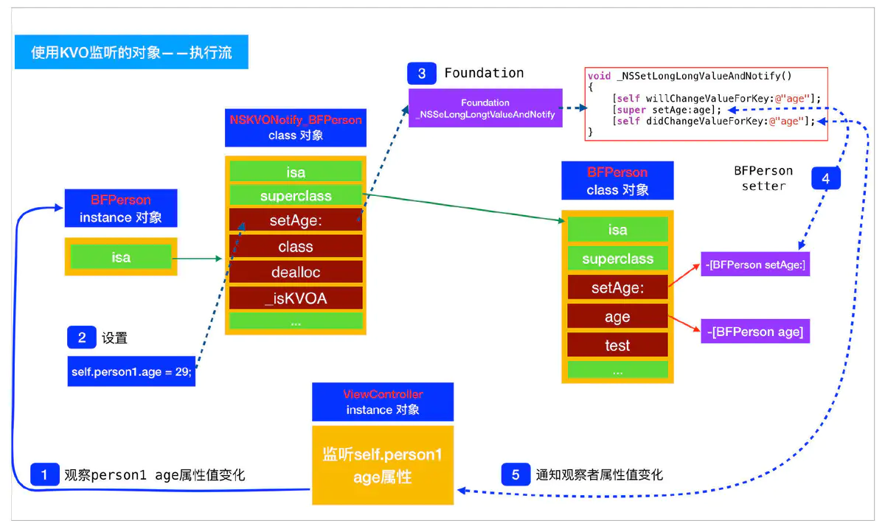
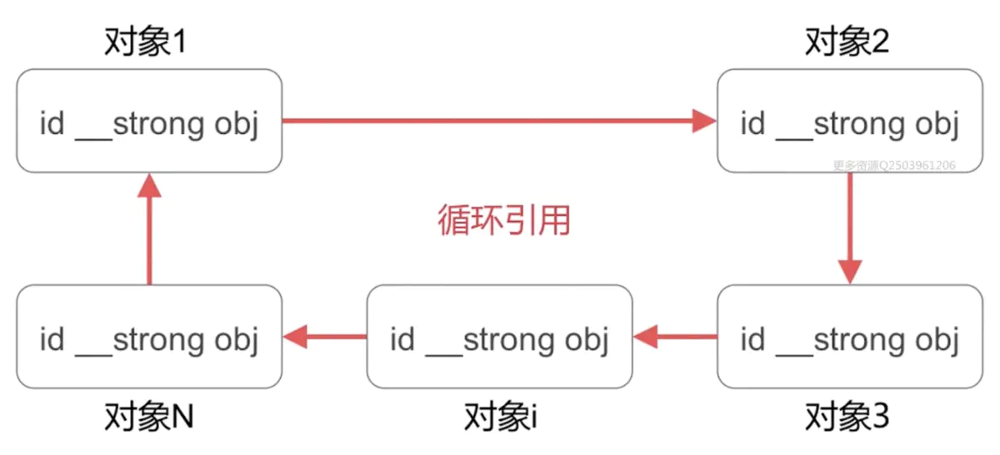

## 基础

<!--------------------------------------------------------------------------------------------------------------------------------------------------------------
                                                               1、说明并比较关键词：strong, weak, assign, copy等等
--------------------------------------------------------------------------------------------------------------------------------------------------------------->
<details>
<summary>
    <b>1、说明并比较关键词：strong, weak, assign, copy等等</b>
</summary>

</br>
`strong`表示指向并拥有该对象。其修饰的对象引用计数会增加1。该对象只要引用计数不为0则不会被销毁。当然强行将其设为nil可以销毁它。

`weak`表示指向但不拥有该对象。其修饰的对象引用计数不会增加。无需手动设置，该对象会自行在内存中销毁。

`assign`主要用于修饰基本数据类型，如`NSInteger`和`CGFloat`，这些数值主要存在于栈上。

`weak` 一般用来修饰对象，`assign`一般用来修饰基本数据类型。原因是`assign`修饰的对象被释放后，指针的地址依然存在，造成野指针，在堆上容易造成崩溃。而栈上的内存系统会自动处理，不会造成野指针。

`copy`与`strong`类似。不同之处是`strong`的复制是多个指针指向同一个地址，而`copy`的复制每次会在内存中拷贝一份对象，指针指向不同地址。`copy`一般用在修饰有可变对应类型的不可变对象上，如`NSString`, `NSArray`, `NSDictionary`。

`Objective-C` 中，基本数据类型的默认关键字是`atomic`, `readwrite`, `assign`；普通属性的默认关键字是`atomic`, `readwrite`, `strong`。

1、属性`readwrite`，`readonly`，`assign`，`retain`，`copy`，`nonatomic` 各自什么作用，他们在那种情况下用?

```
    readwrite：默认的属性，可读可写，生成setter和getter方法。

    readonly：只读，只生成getter方法，也就是说不能修改变量。

    assign：用于声明基本数据类型（int、float）仅设置变量，是赋值属性。

    retain：持有属性，setter方法将传入的参数先保留,再赋值,传入的参数 引用计数retaincount 会加1
```

在堆上开辟一块空间，用指针a指向，然后将指针a赋值(`assign`)给指针b，等于是a和b同时指向这块堆空间，当a不使用这块堆空间的时候，是否要释放这块堆空间？答案是肯定要的，但是这件堆空间被释放后，b就成了野指针。

如何避免这样的问题？ 这就引出了引用计数器，当a指针这块堆空间的时候，引用计数器+1，当b也指向的时候，引用计数器变成了2，当a不再指向这块堆空间时，release-1，引用计数器为1，当b也不指向这块堆空间时，release-1，引用计数器为0，调用`dealloc`函数，空间被释放

总结：当数据类型为`int`，`float`原生类型时，可以使用`assign`。如果是上面那种情况（对象）就是用retain。

`copy`：是赋值特性,`setter`方法将传入对象赋值一份;需要完全一份新的变量时,直接从堆区拿。

当属性是` NSString`、`NSArray`、`NSDictionary`时，既可以用`strong` 修饰，也可以用`copy`修饰。当用`strong`修饰的`NSString` 指向一个`NSMutableString`时，如果在不知情的情况下这个`NSMutableString`的别的引用修改了值，就会出现：一个不可变的字符串却被改变了的情况， 使用`copy`就不会出现这种情况。

 `nonatomic`：非原子性，可以多线程访问，效率高。

`atomic`：原子性，属性安全级别的表示，同一时刻只有一个线程访问，具有资源的独占性，但是效率很低。

`strong`：强引用，引用计数+ 1，ARC下，一个对象如果没有强引用，系统就会释放这个对象。

`weak`：弱引用，不会使引用计数+1.当一个指向对象的强引用都被释放时，这块空间依旧会被释放掉。

使用场景：在ARC下，如果使用`XIB` 或者`SB` 来创建控件，就使用 `weak`。纯代码创建控件时，用`strong`修饰，如果想用`weak` 修饰，就需要先创建控件，然后赋值给用`weak`修饰的对象。

查找了一些资料，发现主要原因是，`controller`需要拥有它自己的`view`（这个`view`是所以子控件的父`view`），因此`viewcontroller`对`view`就必须是强引用（strong reference）,得用`strong`修饰`view`。对于`lable`，它的父`view`是`view`，`view`需要拥有`label`，但是`controller`是不需要拥有`label`的。如果用`strong`修饰，在`view`销毁的情况下，`label`还仍然占有内存，因为`controller`还对它强引用；如果用`weak`修饰，在`view`销毁的时侯`label`的内存也同时被销毁，避免了僵尸指针出现。

用引用计数回答就是：因为`Controller`并不直接“拥有”控件，控件由它的父`view`“拥有”。使用`weak`关键字可以不增加控件引用计数，确保控件与父`view`有相同的生命周期。控件在被`addSubview`后，相当于控件引用计数+1；父`view`销毁后，所有的子`view`引用计数-1，则可以确保父`view`销毁时子`view`立即销毁。`weak`的控件在`removeFromSuperview`后也会立即销毁，而`stron`g的控件不会，因为`Controller`还保有控件强引用。

总结归纳为：当控件的父`view`销毁时，如果你还想继续拥有这个控件，就用`srtong`；如果想保证控件和父`view`拥有相同的生命周期，就用`weak`。当然在大多数情况下用两个都是可以的。

使用`weak`的时候需要特别注意的是：先将控件添加到`superview`上之后再赋值给`self`，避免控件被过早释放。
</details>

<!--------------------------------------------------------------------------------------------------------------------------------------------------------------
                                                                2、atomatic和nonatomic区别和理解
--------------------------------------------------------------------------------------------------------------------------------------------------------------->
<details>
<summary>
<b>2、atomatic和nonatomic区别和理解</b>
</summary>

<br/><b>第一种</b><br/>

`atomic`和`nonatomic`区别用来决定编译器生成的`getter`和`setter`是否为原子操作。`atomic`提供多线程安全,是描述该变量是否支持多线程的同步访问，如果选择了`atomic` 那么就是说，系统会自动的创建`lock`锁，锁定变量。`nonatomic`禁止多线程，变量保护，提高性能。

> `atomic`：默认是有该属性的，这个属性是为了保证程序在多线程情况下，编译器会自动生成一些互斥加锁代码，避免该变量的读写不同步问题。

> `nonatomic`：如果该对象无需考虑多线程的情况，请加入这个属性，这样会让编译器少生成一些互斥加锁代码，可以提高效率。

> `atomic`的意思就是`setter/getter`这个函数，是一个原语操作。如果有多个线程同时调用`setter`的话，不会出现某一个线程执行完`setter`全部语句之前，另一个线程开始执行`setter`情况，相当于函数头尾加了锁一样，可以保证数据的完整性。`nonatomic`不保证`setter/getter`的原语行，所以你可能会取到不完整的东西。因此，在多线程的环境下原子操作是非常必要的，否则有可能会引起错误的结果。

比如`setter`函数里面改变两个成员变量，如果你用`nonatomic`的话，`getter`可能会取到只更改了其中一个变量时候的状态，这样取到的东西会有问题，就是不完整的。当然如果不需要多线程支持的话，用`nonatomic`就够了，因为不涉及到线程锁的操作，所以它执行率相对快些。

下面是载录的网上一段加了`atomic`的例子：
```
{lock}
    if (property != newValue) { 
        [property release]; 
        property = [newValue retain]; 
    }                   
{unlock}
```
可以看出来，用`atomic`会在多线程的设值取值时加锁，中间的执行层是处于被保护的一种状态，`atomic`是oc使用的一种线程保护技术，基本上来讲，就是防止在写入未完成的时候被另外一个线程读取，造成数据错误。而这种机制是耗费系统资源的，所以在iPhone这种小型设备上，如果没有使用多线程间的通讯编程，那么`nonatomic`是一个非常好的选择。

<br/><b>第二种</b><br/>

`atomic`和`nonatomic`用来决定编译器生成的`getter`和`setter`是否为原子操作。

<b>atomic</b>

设置成员变量的`@property`属性时，默认为`atomic`，提供多线程安全。

在多线程环境下，原子操作是必要的，否则有可能引起错误的结果。加了`atomic`，`setter`函数会变成下面这样：
```
{lock}
    if (property != newValue) { 
        [property release]; 
        property = [newValue retain]; 
    }                   
{unlock}
```
<b>nonatomic</b>

禁止多线程，变量保护，提高性能。

`atomic`是`Objc`使用的一种线程保护技术，基本上来讲，是防止在写未完成的时候被另外一个线程读取，造成数据错误。而这种机制是耗费系统资源的，所以在iPhone这种小型设备上，如果没有使用多线程间的通讯编程，那么`nonatomic`是一个非常好的选择。

指出访问器不是原子操作，而默认地，访问器是原子操作。这也就是说，在多线程环境下，解析的访问器提供一个对属性的安全访问，从获取器得到的返回值或者通过设置器设置的值可以一次完成，即便是别的线程也正在对其进行访问。如果你不指定 `nonatomic` ，在自己管理内存的环境中，解析的访问器保留并自动释放返回的值，如果指定了 `nonatomic` ，那么访问器只是简单地返回这个值。

</details>

<!--------------------------------------------------------------------------------------------------------------------------------------------------------------
                                                               3、请说明并比较以下关键词：__weak，__block
--------------------------------------------------------------------------------------------------------------------------------------------------------------->
<details>
<summary>
<b>3、请说明并比较以下关键词：__weak，__block</b>
</summary>

</br>

`__weak`与`weak`基本相同。前者用于修饰变量（variable），后者用于修饰属性（property）。`__weak` 主要用于防止`block`中的循环引用。
`__block`也用于修饰变量。它是引用修饰，所以其修饰的值是动态变化的，即可以被重新赋值的。`__block`用于修饰某些`block`内部将要修改的外部变量。
_`_weak`和`__block`的使用场景几乎与`block`息息相关。而所谓`block`，就是`Objective-C`对于闭包的实现。闭包就是没有名字的函数，或者理解为指向函数的指针。
</details>

<!--------------------------------------------------------------------------------------------------------------------------------------------------------------
                                                               4、什么是KVC?使用场景是什么？
--------------------------------------------------------------------------------------------------------------------------------------------------------------->
<details>
<summary>
    <b>4、什么是KVC?使用场景是什么？</b>
</summary>
    
</br>

* <b> KVC 常用的方法</b>
```
(1)赋值类方法
- (void)setValue:(nullable id)value forKey:(NSString *)key;
- (void)setValue:(nullable id)value forKeyPath:(NSString *)keyPath;
- (void)setValue:(nullable id)value forUndefinedKey:(NSString *)key;
- (void)setValuesForKeysWithDictionary:(NSDictionary<NSString *, id> *)keyedValues;

(2)取值类方法
// 能取得私有成员变量的值
- (id)valueForKey:(NSString *)key;
- (id)valueForKeyPath:(NSString *)keyPath;
- (NSDictionary *)dictionaryWithValuesForKeys:(NSArray *)keys;
```

* <b>KVC 底层实现原理</b></br>
> 当一个对象调用setValue:forKey: 方法时,方法内部会做以下操作:</br>
> 1.判断有没有指定key的set方法,如果有set方法,就会调用set方法,给该属性赋值</br>
> 2.如果没有set方法,判断有没有跟key值相同且带有下划线的成员属性(_key).如果有,直接给该成员属性进行赋值</br>
> 3.如果没有成员属性_key,判断有没有跟key相同名称的属性.如果有,直接给该属性进行赋值</br>
> 4.如果都没有,就会调用 valueforUndefinedKey 和setValue:forUndefinedKey:方法</br>

<b>* KVC 的使用场景</b></br>
<b>1、赋值</b></br>
> (1) KVC 简单属性赋值
```
Person *p = [[Person alloc] init];
//    p.name = @"jack";
//    p.money = 22.2;
使用setValue: forKey:方法能够给属性赋值,等价于直接给属性赋值
[p setValue:@"rose" forKey:@"name"];
[p setValue:@"22.2" forKey:@"money"];
```
> (2) KVC复杂属性赋值
```
//给Person添加 Dog属性
Person *p = [[Person alloc] init];
p.dog = [[Dog alloc] init];
// p.dog.name = @"阿黄";

1)setValue: forKeyPath: 方法的使用
//修改p.dog 的name 属性
[p.dog setValue:@"wangcai" forKeyPath:@"name"];
[p setValue:@"阿花" forKeyPath:@"dog.name"];

2)setValue: forKey: 错误用法
[p setValue:@"阿花" forKey:@"dog.name"];
NSLog(@"%@", p.dog.name);

3)直接修改私有成员变量
[p setValue:@"旺财" forKeyPath:@"_name"];
```
> (3) 添加私有成员变量
```
Person 类中添加私有成员变量_age
[p setValue:@"22" forKeyPath:@"_age"];
```

<b>2、字典转模型</b></br>
```
1)简单的字典转模型
 +(instancetype)videoWithDict:(NSDictionary *)dict {
    JLVideo *videItem = [[JLVideo alloc] init];
    //以前
//    videItem.name = dict[@"name"];
//    videItem.money = [dict[@"money"] doubleValue] ;
    
    //KVC,使用setValuesForKeysWithDictionary:方法,该方法默认根据字典中每个键值对,调用setValue:forKey方法
    // 缺点:字典中的键值对必须与模型中的键值对完全对应,否则程序会崩溃
    [videItem setValuesForKeysWithDictionary:dict];
    return videItem;
}

(2)复杂的字典转模型
注意:复杂字典转模型不能直接通过KVC 赋值,KVC只能在简单字典中使用,比如:
    NSDictionary *dict = @{
                       @"name" : @"jack",
                       @"money": @"22.2",
                       @"dog" : @{
                               @"name" : @"wangcai",
                               @"money": @"11.1"}
                       };
   JLPerson *p = [[JLPerson alloc]init]; // p是一个模型对象
   [p setValuesForKeysWithDictionary:dict];
内部转换原理:
//    [p setValue:@"jack" forKey:@"name"];
//    [p setValue:@"22.2" forKey:@"money"];
//    [p setValue:@{
//                  @"name" : @"wangcai",
//                  @"money": @"11.1",
//
//                  } forKey:@"dog"]; //给 dog赋值一个字典肯定是不对的

(3)KVC解析复杂字典的正确步骤
   NSDictionary *dict = @{
                       @"name" : @"jack",
                       @"money": @"22.2",
                       @"dog" : @{
                               @"name" : @"wangcai",
                               @"price": @"11.1",
                               },
                       //人有好多书
                       @"books" : @[
                               @{
                                   @"name" : @"5分钟突破iOS开发",
                                   @"price" : @"19.8"
                                   },
                               @{
                                   @"name" : @"3分钟突破iOS开发",
                                   @"price" : @"24.8"
                                   },
                               @{
                                   @"name" : @"1分钟突破iOS开发",
                                   @"price" : @"29.8"
                                   }
                               ]
                       };

    XMGPerson *p = [[XMGPerson alloc] init];
     p.dog = [[XMGDog alloc] init];
    [p.dog setValuesForKeysWithDictionary:dict[@"dog"]];
    
    //保存模型的可变数组
    NSMutableArray *arrayM = [NSMutableArray array];
    
    for (NSDictionary *dict in dict[@"books"]) {
        //创建模型
        Book *book = [[Book alloc] init];
        //KVC
        [book setValuesForKeysWithDictionary:dict];
        //将模型保存
        [arrayM addObject:book];
    }
    p.books = arrayM;

备注:
    (1)当字典中的键值对很复杂,不适合用KVC;
    (2)服务器返还的数据,你可能不会全用上,如果在模型一个一个写属性非常麻烦,所以不建议使用KVC字典转模型
```

<b>3、取值</b></br>
> (1) 模型转字典
```
 Person *p = [[Person alloc]init];
 p.name = @"jack";
 p.money = 11.1;
 //KVC取值
 NSLog(@"%@ %@", [p valueForKey:@"name"], [p valueForKey:@"money"]);

 //模型转字典, 根据数组中的键获取到值,然后放到字典中
 NSDictionary *dict = [p dictionaryWithValuesForKeys:@[@"name", @"money"]];
 NSLog(@"%@", dict);
```
> (2) 访问数组中元素的属性值
```
Book *book1 = [[Book alloc] init];
book1.name = @"5分钟突破iOS开发";
book1.price = 10.7;

Book *book2 = [[Book alloc] init];
book2.name = @"4分钟突破iOS开发";
book2.price = 109.7;

Book *book3 = [[Book alloc] init];
book3.name = @"1分钟突破iOS开发";
book3.price = 1580.7;

// 如果valueForKeyPath:方法的调用者是数组，那么就是去访问数组元素的属性值
// 取得books数组中所有Book对象的name属性值，放在一个新的数组中返回
    NSArray *books = @[book1, book2, book3];
    NSArray *names = [books valueForKeyPath:@"name"];
    NSLog(@"%@", names);

//访问属性数组中元素的属性值
Person *p = [[Person alloc]init];
p.books = @[book1, book2, book3];
NSArray *names = [p valueForKeyPath:@"books.name"];
NSLog(@"%@", names);

```
</details>

<!--------------------------------------------------------------------------------------------------------------------------------------------------------------
                                                               5、什么是KVO? 使用场景是什么？
--------------------------------------------------------------------------------------------------------------------------------------------------------------->
<details>
<summary>
    <b>5、什么是KVO? 使用场景是什么？</b>
</summary>

<h4>什么是KVO？</h4>

> `KVO`全称`Key Value Observing`，是苹果提供的一套事件通知机制。允许对象监听另一个对象特定属性的改变，并在改变时接收到事件。由于 `KVO` 的实现机制，只针对属性才会发生作用，一般继承自 `NSObjec`t 的对象都默认支持 `KVO`。</br>
> 
> `KVO`可以监听单个属性的变化，也可以监听集合对象的变化。通过`KVC`的`mutableArrayValueForKey:`等方法获得代理对象，当代理对象的内部对象发生改变时，会回调 `KVO` 监听的方法。集合对象包含 `NSArray` 和 `NSSet`。</br>

<h4>KVO基本使用</h4>

使用KVO大致分为三个步骤：</br>

> 1、通过`addObserver:forKeyPath:options:context:`方法注册观察者，观察者可以接收`keyPath`属性的变化事件</br>
> 2、在观察者中实现`observeValueForKeyPath:ofObject:change:context:`方法，当`keyPath`属性发生改变后，`KVO`会回调这个方法来通知观察者</br>
> 3、当观察者不需要监听时，可以调用`removeObserver:forKeyPath:`方法将`KVO`移除。需要注意的是，调用`removeObserver`需要在观察者消失之前，否则会导致`Crash`</br>

<h4>注册观察者</h4>

```
/*
@observer:就是观察者，是谁想要观测对象的值的改变。
@keyPath:就是想要观察的对象属性。
@options:options一般选择NSKeyValueObservingOptionNew | NSKeyValueObservingOptionOld，这样当属性值发生改变时我们可以同时获得旧值和新值，如果我们只填NSKeyValueObservingOptionNew则属性发生改变时只会获得新值。
@context:想要携带的其他信息，比如一个字符串或者字典什么的。
*/
- (void)addObserver:(NSObject *)observer forKeyPath:(NSString *)keyPath options:(NSKeyValueObservingOptions)options context:(nullable void *)context;
```
<h4>监听回调</h4>

```
/*
@keyPath:观察的属性
@object:观察的是哪个对象的属性
@change:这是一个字典类型的值，通过键值对显示新的属性值和旧的属性值
@context:上面添加观察者时携带的信息
*/
- (void)observeValueForKeyPath:(nullable NSString *)keyPath ofObject:(nullable id)object change:(nullable NSDictionary<NSKeyValueChangeKey, id> *)change context:(nullable void *)context;
```
<h4>调用方式</h4>
<h5>自动调用</h5>

> 调用KVO属性对象时，不仅可以通过点语法和set语法进行调用，还可以使用KVC方法
```
//通过属性的点语法间接调用
objc.name = @"";

// 直接调用set方法
[objc setName:@"Savings"];

// 使用KVC的setValue:forKey:方法
[objc setValue:@"Savings" forKey:@"name"];

// 使用KVC的setValue:forKeyPath:方法
[objc setValue:@"Savings" forKeyPath:@"account.name"];
```
<h5>手动调用</h5>

* KVO 在属性发生改变时的调用是自动的，如果想要手动控制这个调用时机，或想自己实现 KVO 属性的调用，则可以通过 KVO 提供的方法进行调用。</br>
> 1、第一步我们需要认识下面这个方法，如果想要手动调用或自己实现KVO需要重写该方法该方法返回YES表示可以调用，返回NO则表示不可以调用。
```
+ (BOOL)automaticallyNotifiesObserversForKey:(NSString *)theKey {
    BOOL automatic = NO;
    if ([theKey isEqualToString:@"name"]) {
        automatic = NO;//对该key禁用系统自动通知，若要直接禁用该类的KVO则直接返回NO；
    }
    else {
        automatic = [super automaticallyNotifiesObserversForKey:theKey];
    }
    return automatic;
}
```
> 2、第二步我们需要重写setter方法
```
- (void)setName:(NSString *)name {
    if (name != _name) {
        [self willChangeValueForKey:@"name"];
        _name = name;
        [self didChangeValueForKey:@"name"];
    }
}
```
<h4>移除观察者</h4>

```
//需要在不使用的时候,移除监听
- (void)dealloc {
    [self.person removeObserver:self.observerPerson forKeyPath:@"age"];
    [self.person removeObserver:self.observerPerson forKeyPath:@"name"];
}
```

<h4>Crash</h4>
<h5>观察者未实现监听方法</h5>

* 若观察者对象 -observeValueForKeyPath:ofObject:change:context: 未实现，将会 Crash
```
'<KVOViewController: 0x7f90f1402a60>: An -observeValueForKeyPath:ofObject:change:context: message was received but not handled.
```

<h5>未及时移除观察者</h5>

```
Crash： Thread 1: EXC_BAD_ACCESS (code=1, address=0x8)
```
```
//观察者ObserverPersonChage
@interface ObserverPersonChange : NSObject
@end

@implementation ObserverPersonChange

- (void)observeValueForKeyPath:(NSString *)keyPath ofObject:(id)object change:(NSDictionary<NSKeyValueChangeKey,id> *)change context:(void *)context {
    NSLog(@"%@", keyPath);
    if ([keyPath isEqualToString:@"age"]) {
        NSLog(@"age %@", object);
    }
    if ([keyPath isEqualToString:@"name"]) {
        NSLog(@"name %@", object);
    }
}

@end

// KVOViewController
- (void)btn1Click {
    [self.person addObserver:self.observerPerson forKeyPath:@"age" options:(NSKeyValueObservingOptionOld | NSKeyValueObservingOptionNew) context:@"age change"];
    [self.person addObserver:self.observerPerson forKeyPath:@"name" options:(NSKeyValueObservingOptionOld | NSKeyValueObservingOptionNew) context:@"name change"];
}

- (void)btn2Click {
    self.observerPerson = nil;
}

//点击改变person属性值
- (void)btn3Click {
    self.person.age = 10;
    self.person.name = @"小明";
}
```
> 1、假如在当前 `KVOViewController` 中，注册了观察者，点击屏幕，改变被观察对象 `person` 的属性值。</br>
> 2、点击对应按钮，销毁观察者，此时 self.observerPerson 为 nil。</br>
> 3、再次点击btn3按钮，此时 Crash；</br>

<h5>多次移除观察者</h5>

```
Cannot remove an observer for the key path “age” from because it is not registered as an observer.
```

<h4>实际应用</h4>

> KVO主要用来做键值观察操作，想要一个值发生改变后通知另一个对象，则用KVO实现最为合适。斯坦福大学的iOS教程中有一个很经典的案例，通过KVO在Model和Controller之间进行通信。

<h4>KVO实现原理</h4>

> `KVO`是通过`isa` 混写`(isa-swizzling)`技术实现的。在运行时根据原类创建一个中间类，这个中间类是原类的子类，并动态修改当前对象的`isa`指向中间类。并且将`class`方法重写，返回原类的`Class`。所以苹果建议在开发中不应该依赖`isa`指针，而是通过`class`实例方法来获取对象类型。

<h4>测试代码</h4>

```
NSKeyValueObservingOptions option = NSKeyValueObservingOptionOld | NSKeyValueObservingOptionNew;

NSLog(@"person添加KVO监听对象之前-类对象 -%@", object_getClass(self.person));
NSLog(@"person添加KVO监听之前-方法实现 -%p", [self.person methodForSelector:@selector(setAge:)]);
NSLog(@"person添加KVO监听之前-元类对象 -%@", object_getClass(object_getClass(self.person)));

[self.person addObserver:self forKeyPath:@"age" options:option context:@"age chage"];

NSLog(@"person添加KVO监听对象之后-类对象 -%@", object_getClass(self.person));
NSLog(@"person添加KVO监听之后-方法实现 -%p", [self.person methodForSelector:@selector(setAge:)]);
NSLog(@"person添加KVO监听之后-元类对象 -%@", object_getClass(object_getClass(self.person)));

//打印结果
person添加KVO监听对象之前-类对象 -Person
person添加KVO监听之前-方法实现 -0x10ac1b850
person添加KVO监听之前-元类对象 -Person

person添加KVO监听对象之后-类对象 -NSKVONotifying_Person
person添加KVO监听之后-方法实现 -0x10af7c844
person添加KVO监听之后-元类对象 -NSKVONotifying_Person

//通过地址查找方法
(lldb) p (IMP)0x10f24b470
(IMP) $0 = 0x000000010f24b470 ([Person setAge:] at Person.h:15)
(lldb) p (IMP)0x10f5a6844
(IMP) $1 = 0x000000010f5a6844 (Foundation`_NSSetLongLongValueAndNotify)
```
* 通过测试代码，我们添加KVO前后发生以下变化</br>
> 1、`person`指向的类对象和元类对象，以及 `setAge:` 均发生了变化；</br>
> 2、添加`KVO`后，`person` 中的 `isa` 指向了 `NSKVONotifying_Person` 类对象；</br>
> 3、添加 `KVO` 之后，`setAge:` 的实现调用的是：`Foundation`中 `_NSSetLongLongValueAndNotify` 方法；</br>

<h5>发现中间对象</h5>

> 从上述测试代码的结果我们发现，`person` 中的 `isa` 从开始指向`Person`类对象，变成指向了 `NSKVONotifying_Person` 类对象</br>

* KVO会在运行时动态创建一个新类，将对象的isa指向新创建的类，新类是原类的子类，命名规则是NSKVONotifying_xxx的格式。</br>
> 1、未使用KVO监听对象是，对象和类对象之间的关系如下</br>


> 2、使用KVO监听对象后，对象和类对象之间会添加一个中间对象</br>


<h5>NSKVONotifying_Person类内部实现</h5>

> 我们从上面两张图很清楚的看到添加KVO之前和KVO之后的变化，下面我们剖析一下这个中间类NSKVONotifying_Person（这里是*通配符,它代表数据类型，例如：int， longlong）</br>
```
- (void)setAge:(int)age{
    _NSSet*ValueAndNotify();//这个方法调用顺序是什么，它是在调用何处方法，都在setter方法改变中详解
}

- (Class)class {
    return [LDPerson class];
}

- (void)dealloc {
    // 收尾工作
}

- (BOOL)_isKVOA {
    return YES;
}
```
* isa混写之后如何调用方法</br>
  - 调用监听的属性设置方法，如 `setAge:`，都会先调用 `NSKVONotify_Person` 对应的属性设置方法；</br>
  - 调用非监听属性设置方法，如 `test`，会通过 `NSKVONotify_Person` 的 `superclass`，找到 `Person` 类对象，再调用其 `[Person test]` 方法</br>
* 为什么重写class方法</br>
  - 如果没有重写`class`方法,当该对象调用`class`方法时,会在自己的方法缓存列表,方法列表,父类缓存,方法列表一直向上去查找该方法,因为`class`方法是`NSObject`中的方法,如果不重写最终可能会返回`NSKVONotifying_Person`,就会将该类暴露出来,也给开发者造成困扰,写的是`Person`,添加`KVO`之后`class`方法返回怎么是另一个类。</br>
* _isKVOA有什么作用。</br>
  - 这个方法可以当做使用了`KVO`的一个标记，系统可能也是这么用的。如果我们想判断当前类是否是`KVO`动态生成的类，就可以从方法列表中搜索这个方法。</br>

<h4>setter实现不同</h4>

* 在测试代码中，我们已经通过地址查找添加KVO前后调用的方法</br>

```
//通过地址查找方法
//添加KVO之前
(lldb) p (IMP)0x10f24b470
(IMP) $0 = 0x000000010f24b470 ([Person setAge:] at Person.h:15)
//添加KVO之后
(lldb) p (IMP)0x10f5a6844
(IMP) $1 = 0x000000010f5a6844 (Foundation`_NSSetLongLongValueAndNotify)
```
> `0x10f24b470`这个地址的`setAge:`实现是调用`Person`类的`setAge:`方法，并且是在`Person.h`的第15行。</br>
> 而`0x10f5a6844`这个地址的`setAge:`实现是调用`_NSSetIntValueAndNotify`这样一个C函数。</br>

<h4>KVO内部调用流程</h4>

* 由于我们无法去窥探`_NSSetIntValueAndNotify`的真实结构，也无法去重写`NSKVONotifying_Person`这个类，所以我们只能利用它的父类`Person`类来分析其执行过程。</br>
```
- (void)setAge:(int)age{
    _age = age;
    NSLog(@"setAge:");
}

- (void)willChangeValueForKey:(NSString *)key{
    [super willChangeValueForKey:key];
    NSLog(@"willChangeValueForKey");
}

- (void)didChangeValueForKey:(NSString *)key{
    NSLog(@"didChangeValueForKey - begin");
    [super didChangeValueForKey:key];
    NSLog(@"didChangeValueForKey - end");
}
@end

//打印结果
 willChangeValueForKey
 setAge:
 didChangeValueForKey - begin
 didChangeValueForKey - end
 willChangeValueForKey
 didChangeValueForKey - begin
 didChangeValueForKey - end
```
* 通过打印结果，我们可以清晰看到
> 1、首先调用`willChangeValueForKey:`方法。</br>
> 2、然后调用`setAge:`方法真正的改变属性的值。</br>
> 3、开始调用`didChangeValueForKey:`这个方法，调用`[super didChangeValueForKey:key]`时会通知监听者属性值已经改变，然后监听者执行自己的`- (void)observeValueForKeyPath:(NSString *)keyPath ofObject:(id)object change:(NSDictionary<NSKeyValueChangeKey,id> *)change context:(void *)context`这个方法。</br>

* 下面我用一张图来展示KVO执行流程</br>


<h4>KVO扩展</h4>

* KVC 与 KVO 的不同？</br>
> 1. `KVC`(键值编码)，即 `Key-Value Coding`，一个非正式的` Protocol`，使用字符串(键)访问一个对象实例变量的机制。而不是通过调用 `Setter`、`Getter` 方法等显式的存取方式去访问。</br>
> 2. `KVO`(键值监听)，即 `Key-Value Observing`，它提供一种机制,当指定的对象的属性被修改后,对象就会接受到通知，前提是执行了 `setter` 方法、或者使用了`KVC` 赋值。</br>

* 和 notification(通知)的区别？</br>
> 1. `KVO` 和 `NSNotificationCenter` 都是 `iOS` 中观察者模式的一种实现。区别在于，相对于被观察者和观察者之间的关系，`KVO` 是一对一的，而不是一对多的。`KVO` 对被监听对象无侵入性，不需要修改其内部代码即可实现监听。</br>
> 2. `notification` 的优点是监听不局限于属性的变化，还可以对多种多样的状态变化进行监听，监听范围广，例如键盘、前后台等系统通知的使用也更显灵活方便。

</details>

<!--------------------------------------------------------------------------------------------------------------------------------------------------------------
                                                               6、Runtime应用 
--------------------------------------------------------------------------------------------------------------------------------------------------------------->
<details>
<summary>
    <b>6、Runtime应用</b>
</summary>

</br>
`Runtim`简直就是做大型框架的利器。它的应用场景非常多，下面就介绍一些常见的应用场景。

>* 关联对象`(Objective-C Associated Objects)`给分类增加属性
>* 方法魔法`(Method Swizzling)`方法添加和替换和`KVO`
>* 实现消息转发(热更新)解决Bug(JSPatch)
>* 实现`NSCoding`的自动归档和自动解档
>* 实现字典和模型的自动转换`(MJExtension)`

<b>关联对象(Objective-C Associated Objects)给分类增加属性</b>

关联对象`Runtime`提供了下面几个接口：

```
// 关联对象
void objc_setAssociatedObject(id object, const void *key, id value, objc_AssociationPolicy policy)
// 获取关联的对象
id objc_getAssociatedObject(id object, const void *key)
// 移除关联的对象
void objc_removeAssociatedObjects(id object)
```

参数解释:

`id object`：被关联的对象</br>
`const void *key`：关联的key，要求唯一</br>
`id value`：关联的对象</br>
`objc_AssociationPolicy policy`：内存管理的策略内存管理的策略</br>

```
typedef OBJC_ENUM(uintptr_t, objc_AssociationPolicy) {
    OBJC_ASSOCIATION_ASSIGN = 0,
    OBJC_ASSOCIATION_RETAIN_NONATOMIC = 1,
    OBJC_ASSOCIATION_COPY_NONATOMIC = 3, 
    OBJC_ASSOCIATION_RETAIN = 01401,
    OBJC_ASSOCIATION_COPY = 01403
};
```

`OBJC_ASSOCIATION_ASSIGN`: 指定一个关联对象的弱引用。属性修饰`@property (assign)` 或 `@property (unsafe_unretained)`</br>
`OBJC_ASSOCIATION_RETAIN_NONATOMIC`: 指定一个关联对象的强引用，不能被原子化使用。属性修饰`@property (nonatomic, strong)`</br>
`OBJC_ASSOCIATION_COPY_NONATOMIC`: 指定一个关联对象的`copy`引用，不能被原子化使用。属性修饰`@property (nonatomic, copy)`</br>
`OBJC_ASSOCIATION_RETAIN`:  指定一个关联对象的强引用，能被原子化使用。属性修饰 `@property (atomic, strong)`</br>
`OBJC_ASSOCIATION_COPY`:  指定一个关联对象的`copy`引用，能被原子化使用。属性修饰`@property (atomic, copy)`</br>

下面实现一个`UIView`的`Category`添加自定义属性`defaultColor`

```
#import "ViewController.h"
#import "objc/runtime.h"

@interface UIView (DefaultColor)

@property (nonatomic, strong) UIColor *defaultColor;

@end

@implementation UIView (DefaultColor)

@dynamic defaultColor;

static char kDefaultColorKey;

- (void)setDefaultColor:(UIColor *)defaultColor {
    objc_setAssociatedObject(self, &kDefaultColorKey, defaultColor, OBJC_ASSOCIATION_RETAIN_NONATOMIC);
}

- (id)defaultColor {
    return objc_getAssociatedObject(self, &kDefaultColorKey);
}

@end

@interface ViewController ()

@end

@implementation ViewController

- (void)viewDidLoad {
    [super viewDidLoad];
    
    UIView *test = [UIView new];
    test.defaultColor = [UIColor blackColor];
    NSLog(@"%@", test.defaultColor);
}

@end
```

<b> 方法魔法(Method Swizzling)方法添加和替换和KVO实现</b>
<b>方法添加</b>
```
//class_addMethod(Class  _Nullable __unsafe_unretained cls, SEL  _Nonnull name, IMP  _Nonnull imp, const char * _Nullable types)
class_addMethod([self class], sel, (IMP)fooMethod, "v@:");
```
>1、cls 被添加方法的类</br>
2、name 添加的方法的名称的SEL</br>
3、imp 方法的实现。该函数必须至少要有两个参数，self,_cmd</br>
4、types 类型编码

<b>方法替换</b>
```
@implementation ViewController

+ (void)load {
    static dispatch_once_t onceToken;
    dispatch_once(&onceToken, ^{
        Class class = [self class];
        SEL originalSelector = @selector(test1);
        SEL swizzledSelector = @selector(test2);
        
        Method originalMethod = class_getInstanceMethod(class, originalSelector);
        Method swizzledMethod = class_getInstanceMethod(class, swizzledSelector);
        
        BOOL didAddMethod = class_addMethod(class, originalSelector, method_getImplementation(swizzledMethod), method_getTypeEncoding(swizzledMethod));
        if (didAddMethod) {
            class_replaceMethod(class, swizzledSelector, method_getImplementation(originalMethod), method_getTypeEncoding(originalMethod));
        } else {
            method_exchangeImplementations(originalMethod, swizzledMethod);
        }
    });
}

- (void)test1 {
    NSLog(@"1");
}

- (void)test2 {
    NSLog(@"2");
}

- (void)viewDidLoad {
    [super viewDidLoad];
    
    [self test1];
}
```
>在`viewDidLoad`中调用`test1`方法，查找到的对应的方法实现就是`test2`,而不是`test1`

`swizzling`应该只在`+load`中完成。 在 `Objective-C `的运行时中，每个类有两个方法都会自动调用。`+load `是在一个类被初始装载时调用，`+initialize` 是在应用第一次调用该类的类方法或实例方法前调用的。两个方法都是可选的，并且只有在方法被实现的情况下才会被调用。

`swizzlin`g应该只在`dispatch_once `中完成,由于`swizzling `改变了全局的状态，所以我们需要确保每个预防措施在运行时都是可用的。原子操作就是这样一个用于确保代码只会被执行一次的预防措施，就算是在不同的线程中也能确保代码只执行一次。Grand Central Dispatch 的 `dispatch_once`满足了所需要的需求，并且应该被当做使用`swizzling `的初始化单例方法的标准。
</details>

<!--------------------------------------------------------------------------------------------------------------------------------------------------------------
                                                               7、循环引用
--------------------------------------------------------------------------------------------------------------------------------------------------------------->
<details>
<summary>
    <b>7、循环引用</b>
</summary>

</br><b>循环引用的实质：多个对象相互之间有强引用，不能释放让系统回收。</b></br>
<b>如何解决循环引用？</b></br>
>1、避免产生循环引用，通常是将 `strong` 引用改为 `weak` 引用。
比如在修饰属性时用`weak`
在`block`内调用对象方法时，使用其弱引用，这里可以使用两个宏
```
#define WS(weakSelf)            __weak __typeof(&*self)weakSelf = self; // 弱引用
#define ST(strongSelf)          __strong __typeof(&*self)strongSelf = weakSelf; //使用这个要先声明weakSelf
```
还可以使用__block来修饰变量</br>
在MRC下，__block不会增加其引用计数，避免了循环引用</br>
在ARC下，__block修饰对象会被强引用，无法避免循环引用，需要手动解除。</br>

<b>循环引用场景：</b>
* 自循环引用
    - 强持有的属性同时持有该对象
* 相互循环引用
    
* 多循环引用
    

<b>1、代理(delegate)循环引用属于相互循环引用</b></br>
delegate 是iOS中开发中比较常遇到的循环引用，一般在声明delegate的时候都要使用弱引用 weak,或者assign,当然怎么选择使用assign还是weak，MRC的话只能用assign，在ARC的情况下最好使用weak，因为weak修饰的变量在释放后自动指向nil，防止野指针存在</br>

<b>2、NSTimer循环引用属于相互循环使用</b></br>
在控制器内，创建NSTimer作为其属性，由于定时器创建后也会强引用该控制器对象，那么该对象和定时器就相互循环引用了。</br>
如何解决呢？</br>
这里我们可以使用手动断开循环引用：</br>
如果是不重复定时器，在回调方法里将定时器invalidate并置为nil即可。</br>
如果是重复定时器，在合适的位置将其invalidate并置为nil即可</br>

<b>3、block循环引用</b></br>
一个简单的例子：</br>
```
@property (copy, nonatomic) dispatch_block_t myBlock;
@property (copy, nonatomic) NSString *blockString;

- (void)testBlock {
    self.myBlock = ^() {
        NSLog(@"%@",self.blockString);
    };
}
```
由于block会对block中的对象进行持有操作,就相当于持有了其中的对象，而如果此时block中的对象又持有了该block，则会造成循环引用。
解决方案就是使用__weak修饰self即可
```
__weak typeof(self) weakSelf = self;

self.myBlock = ^() {
    NSLog(@"%@",weakSelf.blockString);
};
```
并不是所有block都会造成循环引用。</br>
只有被强引用了的block才会产生循环引用</br>
而比如`dispatch_async(dispatch_get_main_queue(), ^{})`,`[UIView animateWithDuration:1 animations:^{}]`这些系统方法等
或者block并不是其属性而是临时变量,即栈block
```
[self testWithBlock:^{
    NSLog(@"%@",self);
}];

- (void)testWithBlock:(dispatch_block_t)block {
    block();
}
```
还有一种场景，在block执行开始时self对象还未被释放，而执行过程中，self被释放了，由于是用weak修饰的，那么weakSelf也被释放了，此时在block里访问weakSelf时，就可能会发生错误(向nil对象发消息并不会崩溃，但也没任何效果)。</br>
对于这种场景，应该在block中对 对象使用__strong修饰，使得在block期间对 对象持有，block执行结束后，解除其持有。
```
__weak typeof(self) weakSelf = self;

self.myBlock = ^() {
    __strong __typeof(self) strongSelf = weakSelf;
    [strongSelf test];
};
```
</details>

<!--------------------------------------------------------------------------------------------------------------------------------------------------------------
                                                               8、Block原理、Block变量截获、Block的三种形式、__block
--------------------------------------------------------------------------------------------------------------------------------------------------------------->
<details>
<summary>
    <b>8、Block原理、Block变量截获、Block的三种形式、__block</b>
</summary>

</br><b>一、什么是Block？</b></br>
* Block是将函数及其执行上下文封装起来的对象。
```
NSInteger num = 3;
NSInteger(^block)(NSInteger) = ^NSInteger(NSInteger n){
    return n * num;
};
block(2);
```
通过clang -rewrite-objc WYTest.m命令编译该.m文件，发现该block被编译成这个形式:
```
NSInteger num = 3;

NSInteger(*block)(NSInteger) = ((NSInteger (*)(NSInteger))&__WYTest__blockTest_block_impl_0((void *)__WYTest__blockTest_block_func_0, &__WYTest__blockTest_block_desc_0_DATA, num));

((NSInteger (*)(__block_impl *, NSInteger))((__block_impl *)block)->FuncPtr)((__block_impl *)block, 2);
```
其中WYTest是文件名，blockTest是方法名，这些可以忽略。</br>
其中__WYTest__blockTest_block_impl_0结构体为
```
struct __WYTest__blockTest_block_impl_0 {
  struct __block_impl impl;
  struct __WYTest__blockTest_block_desc_0* Desc;
  NSInteger num;
  __WYTest__blockTest_block_impl_0(void *fp, struct __WYTest__blockTest_block_desc_0 *desc, NSInteger _num, int flags=0) : num(_num) {
    impl.isa = &_NSConcreteStackBlock;
    impl.Flags = flags;
    impl.FuncPtr = fp;
    Desc = desc;
  }
};
```
_block_impl结构体为
```
struct __block_impl {
  void *isa;//isa指针，所以说Block是对象
  int Flags;
  int Reserved;
  void *FuncPtr;//函数指针
};
```
block内部有isa指针，所以说其本质也是OC对象</br>
block内部则为:
```
static NSInteger __WYTest__blockTest_block_func_0(struct __WYTest__blockTest_block_impl_0 *__cself, NSInteger n) {
    NSInteger num = __cself->num; // bound by copy
    return n * num;
}
```
所以说 Block是将函数及其执行上下文封装起来的对象</br>
既然block内部封装了函数，那么它同样也有参数和返回值。</br></br>

<b>二、Block变量截获</b></br></br>
<b>1、局部变量截获 是值截获。 比如:</b>
```
NSInteger num = 3;
    
NSInteger(^block)(NSInteger) = ^NSInteger(NSInteger n){
    return n*num;
};

num = 1;

NSLog(@"%zd",block(2));
```
这里的输出是6而不是2，原因就是对局部变量num的截获是值截获。</br>
同样，在block里如果修改变量num，也是无效的，甚至编译器会报错。</br>
```
NSMutableArray * arr = [NSMutableArray arrayWithObjects:@"1",@"2", nil];
void(^block)(void) = ^{
    NSLog(@"%@",arr);//局部变量
    [arr addObject:@"4"];
};
[arr addObject:@"3"];
arr = nil;
block();
```
打印为1，2，3</br>
局部对象变量也是一样，截获的是值，而不是指针，在外部将其置为nil，对block没有影响，而该对象调用方法会影响</br>

<b>2、局部静态变量截获 是指针截获。</b>
```
tatic  NSInteger num = 3;
NSInteger(^block)(NSInteger) = ^NSInteger(NSInteger n){
    return n*num;
};
num = 1;
NSLog(@"%zd",block(2));
```
输出为2，意味着num = 1这里的修改num值是有效的，即是指针截获。</br>
同样，在block里去修改变量m，也是有效的。</br>

<b>3、全局变量，静态全局变量截获：不截获,直接取值。</b></br></br>
我们同样用clang编译看下结果。</br>
```
static NSInteger num3 = 300;
NSInteger num4 = 3000;

- (void)blockTest {
    NSInteger num = 30;
    static NSInteger num2 = 3;
    __block NSInteger num5 = 30000;
    void(^block)(void) = ^{
        NSLog(@"%zd",num);//局部变量
        NSLog(@"%zd",num2);//静态变量
        NSLog(@"%zd",num3);//全局变量
        NSLog(@"%zd",num4);//全局静态变量
        NSLog(@"%zd",num5);//__block修饰变量
    };
    block();
}
```
编译后
```
struct __WYTest__blockTest_block_impl_0 {
  struct __block_impl impl;
  struct __WYTest__blockTest_block_desc_0* Desc;
  NSInteger num;//局部变量
  NSInteger *num2;//静态变量
  __Block_byref_num5_0 *num5; // by ref//__block修饰变量
  __WYTest__blockTest_block_impl_0(void *fp, struct __WYTest__blockTest_block_desc_0 *desc, NSInteger _num, NSInteger *_num2, __Block_byref_num5_0 *_num5, int flags=0) : num(_num), num2(_num2), num5(_num5->__forwarding) {
    impl.isa = &_NSConcreteStackBlock;
    impl.Flags = flags;
    impl.FuncPtr = fp;
    Desc = desc;
  }
};
```
 impl.isa = &_NSConcreteStackBlock;这里注意到这一句，即说明该block是栈block）
可以看到局部变量被编译成值形式，而静态变量被编成指针形式，全局变量并未截获。而__block修饰的变量也是以指针形式截获的，并且生成了一个新的结构体对象：
```
struct __Block_byref_num5_0 {
  void *__isa;
  __Block_byref_num5_0 *__forwarding;
 int __flags;
 int __size;
 NSInteger num5;
};
```
该对象有个属性：num5，即我们用__block修饰的变量。</br>
这里__forwarding是指向自身的(栈block)。</br>
一般情况下，如果我们要对block截获的局部变量进行赋值操作需添加__block</br>
修饰符，而对全局变量，静态变量是不需要添加__block修饰符的。</br>
另外，block里访问self或成员变量都会去截获self。</br>

<b>三、Block的几种形式</b></br>
分为全局Block(_NSConcreteGlobalBlock)、栈Block(_NSConcreteStackBlock)、堆Block(_NSConcreteMallocBlock)三种形式</br>
其中栈Block存储在栈(stack)区，堆Block存储在堆(heap)区，全局Block存储在已初始化数据(.data)区</br>

<b>1、不使用外部变量的block是全局block</b></br></br>
比如：
```
NSLog(@"%@",[^{
    NSLog(@"globalBlock");
} class]);
```
输出：
```
_NSGlobalBlock__
```
<b>2、使用外部变量并且未进行copy操作的block是栈block</b></br></br>
比如:
```
NSInteger num = 10;
NSLog(@"%@",[^{
    NSLog(@"stackBlock:%zd",num);
} class]);
```
输出：
```
__NSStackBlock__
```
日常开发常用于这种情况:
```
[self testWithBlock:^{
    NSLog(@"%@",self);
}];

- (void)testWithBlock:(dispatch_block_t)block {
    block();
    NSLog(@"%@",[block class]);
}
```
<b>3、对栈block进行copy操作，就是堆block，而对全局block进行copy，仍是全局block</b></br>
* 比如堆1中的全局进行copy操作，即赋值：
```
void (^globalBlock)(void) = ^{
    NSLog(@"globalBlock");
};

NSLog(@"%@",[globalBlock class]);
```
输出：
```
_NSGlobalBlock__
```
仍是全局block

* 而对2中的栈block进行赋值操作：
```
NSInteger num = 10;

void (^mallocBlock)(void) = ^{
    NSLog(@"stackBlock:%zd",num);
};

NSLog(@"%@",[mallocBlock class]);
```
输出：
```
__NSMallocBlock__
```
对栈block copy之后，并不代表着栈block就消失了，左边的mallock是堆block，右边被copy的仍是栈block</br></br>
比如:
```
[self testWithBlock:^{
    NSLog(@"%@",self);
}];

- (void)testWithBlock:(dispatch_block_t)block {
    block();
    dispatch_block_t tempBlock = block;
    NSLog(@"%@,%@",[block class],[tempBlock class]);
}
```
输出：
```
__NSStackBlock__, __NSMallocBlock__
```
<b>即如果对栈Block进行copy，将会copy到堆区，对堆Block进行copy，将会增加引用计数，对全局Block进行copy，因为是已经初始化的，所以什么也不做。</b></br></br>
另外，__block变量在copy时，由于__forwarding的存在，栈上的__forwarding指针会指向堆上的__forwarding变量，而堆上的__forwarding指针指向其自身，所以，如果对__block的修改，实际上是在修改堆上的__block变量。</br></br>
<b>即__forwarding指针存在的意义就是，无论在任何内存位置， 都可以顺利地访问同一个__block变量。</b></br></br>
另外由于block捕获的__block修饰的变量会去持有变量，那么如果用__block修饰self，且self持有block，并且block内部使用到__block修饰的self时，就会造成多循环引用，即self持有block，block 持有__block变量，而__block变量持有self，造成内存泄漏。</br></br>
比如:
```
_block typeof(self) weakSelf = self;
    
_testBlock = ^{
    NSLog(@"%@",weakSelf);
};

_testBlock();
```
如果要解决这种循环引用，可以主动断开__block变量对self的持有，即在block内部使用完weakself后，将其置为nil，但这种方式有个问题，如果block一直不被调用，那么循环引用将一直存在。
所以，我们最好还是用__weak来修饰self
</details>

<!--------------------------------------------------------------------------------------------------------------------------------------------------------------
                                                               9、类（class）和结构体（struct）有什么区别？
--------------------------------------------------------------------------------------------------------------------------------------------------------------->
<details>
<summary>
    <b>9、类（class）和结构体（struct）有什么区别？</b>
</summary>
    
</br>

Swift 中，类是引用类型，结构体是值类型。值类型在传递和赋值时将进行复制，而引用类型则只会使用引用对象的一个"指向"。所以他们两者之间的区别就是两个类型的区别。</br>

举个简单的例子，代码如下
```
class Temperature {
  var value: Float = 37.0
}

class Person {
  var temp: Temperature?

  func sick() {
    temp?.value = 41.0
  }
}

let A = Person()
let B = Person()
let temp = Temperature()

A.temp = temp
B.temp = temp
```
A.sick()</br>
上面这段代码，由于 Temperature 是 class ，为引用类型，故 A 的 temp 和 B 的 temp指向同一个对象。A 的 temp修改了，B 的 temp 也随之修改。这样 A 和 B 的 temp 的值都被改成了41.0。如果将 Temperature 改为 struct，为值类型，则 A 的 temp 修改不影响 B 的 temp。</br>

内存中，引用类型诸如类是在堆（heap）上，而值类型诸如结构体实在栈（stack）上进行存储和操作。相比于栈上的操作，堆上的操作更加复杂耗时，所以苹果官方推荐使用结构体，这样可以提高 App 运行的效率。</br>

class有这几个功能struct没有的：</br>

class可以继承，这样子类可以使用父类的特性和方法</br>
类型转换可以在runtime的时候检查和解释一个实例的类型</br>
可以用deinit来释放资源</br>
一个类可以被多次引用</br>
struct也有这样几个优势：</br>

结构较小，适用于复制操作，相比于一个class的实例被多次引用更加安全。</br>
无须担心内存memory leak或者多线程冲突问题</br>
</details>

<!--------------------------------------------------------------------------------------------------------------------------------------------------------------
                                                               10、
--------------------------------------------------------------------------------------------------------------------------------------------------------------->
<details>
<summary>
    <b></b>
</summary>
</details>

<!--------------------------------------------------------------------------------------------------------------------------------------------------------------
                                                               11、
--------------------------------------------------------------------------------------------------------------------------------------------------------------->
<details>
<summary>
    <b></b>
</summary>
</details>
